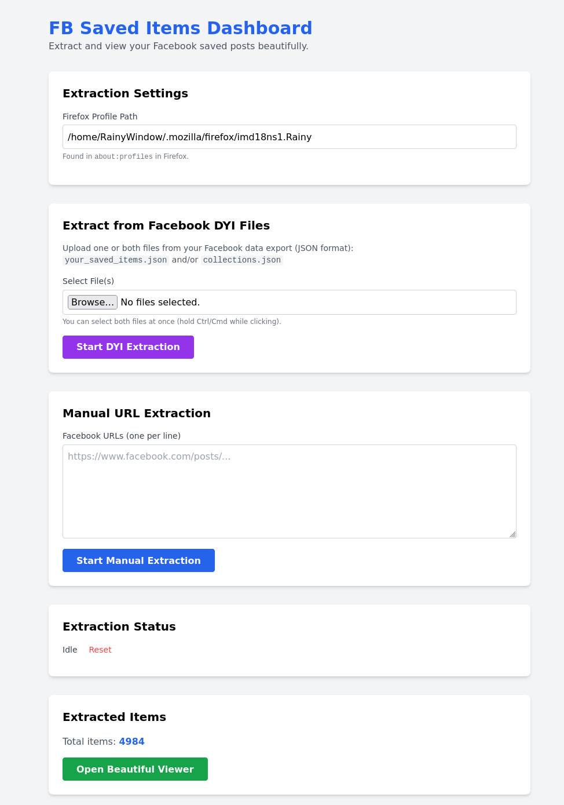
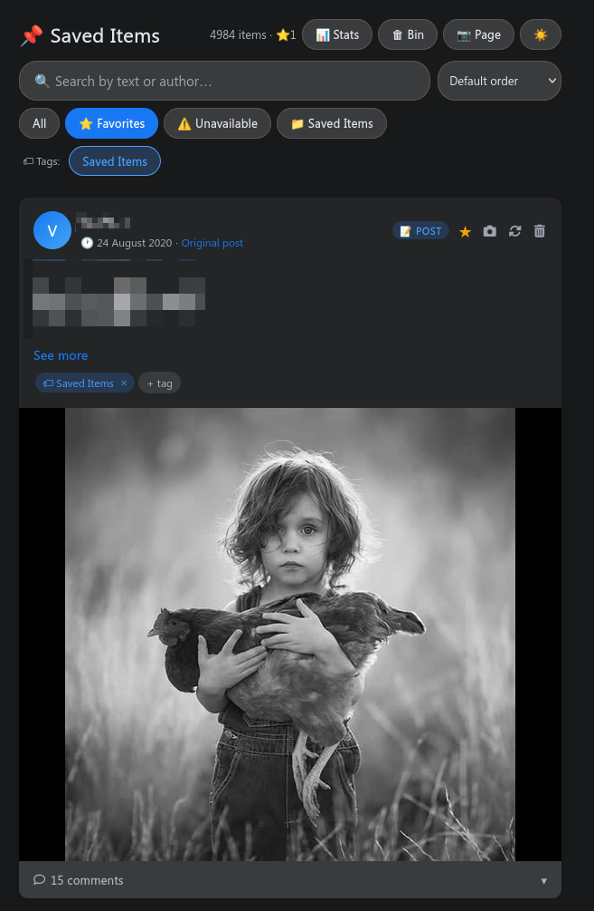
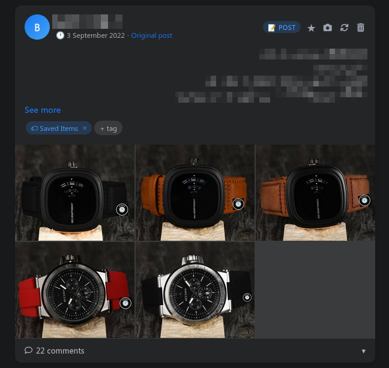
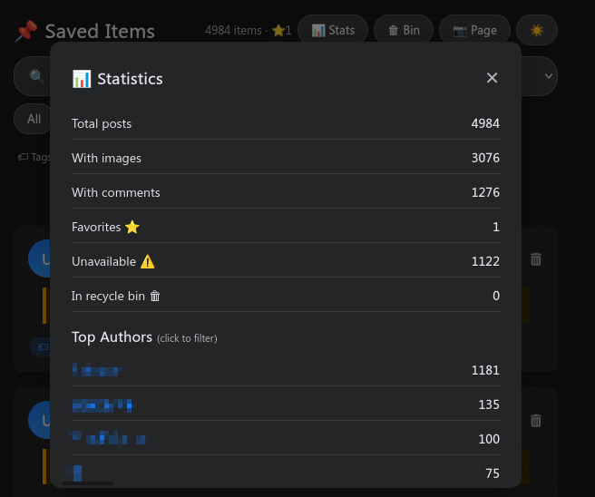

# 📌 FBSave — Facebook Saved Posts Extractor & Viewer

> A local, privacy-first tool to extract, archive, and beautifully
> browse all your Facebook Saved posts — including text, images,
> comments, reactions, and more. Runs entirely on your own machine.
> No data ever leaves your computer.


---

## ⚠️ Security Warning

**This application is built strictly for local usage (`localhost` / `127.0.0.1`).** * **No Authentication:** The backend endpoints do not require a login username or password. 
* **Network Risk:** Do **NOT** host or deploy this application publicly on the open web (such as AWS, Heroku, Render, or an exposed home server ip) without adding an authentication layer. Doing so would allow anyone on the internet to trigger scraper tasks, upload files, or view/wipe your data.

---

---

## 📸 Screenshots

| Dashboard | Viewer (Dark Mode) |
|:---:|:---:|
|  |  |

| Post Card with Images | Stats Panel |
|:---:|:---:|
|  |  |


---

## 📋 Table of Contents

- [Features](#-features)
- [How It Works](#-how-it-works)
- [System Requirements](#-system-requirements)
- [Installation](#-installation)
- [Finding Your Firefox Profile Path](#-finding-your-firefox-profile-path)
- [Usage](#-usage)
- [Offline Export](#-offline-export)
- [Project Structure](#-project-structure)
- [Known Limitations](#-known-limitations)
- [Privacy & Security](#-privacy--security)
- [Troubleshooting](#-troubleshooting)
- [Contributing](#-contributing)
- [Support the Project](#-support-the-project)
- [License](#-license)
- [Disclaimer](#-disclaimer)

---

## ✨ Features

- 🔐 **No password required** — borrows your existing Firefox login
  session by reading your local browser cookies
- 📥 **Bulk DYI import** — upload your Facebook "Download Your
  Information" JSON export to import thousands of saved post URLs
  at once
- 🖼️ **Full image extraction** — follows photo album links to collect
  all images, not just the first 5 shown in the collage
- 💬 **Comments & replies** — extracts up to 50 top-level comments
  with nested reply threads
- 🌐 **RTL language support** — right-to-left scripts (Hebrew, Farsi,
  Urdu, and others) are fully supported with correct text direction
  and alignment
- 🌙 **Beautiful dark/light viewer** — Facebook-style post cards with
  image lightbox, pagination, and smooth transitions
- 🏷️ **Tags & collections** — auto-tagged from your Facebook
  collections, fully editable per post
- ⭐ **Favorites** — star any post to find it quickly later
- 🗑️ **Recycle bin** — soft delete with restore; permanently delete
  when you're ready
- 📊 **Statistics** — top authors, tag cloud, collection breakdown
- 📷 **Screenshot** — save any post as a PNG image
- 📦 **Offline export** — generate a single self-contained HTML file
  with all posts and images embedded (no internet or server needed)
- 🔍 **Search & filter** — search by text or author, filter by
  collection, tag, favorites, or unavailable posts
- ♻️ **Safe resume** — if interrupted, the scraper picks up exactly
  where it left off on the next run

---

## 🔧 How It Works

1. You provide the path to your Firefox profile folder on your computer
2. The tool reads your Facebook login cookies from that profile
   (it never asks for or stores your password)
3. A headless (invisible) Firefox browser opens and visits each saved
   post URL using your existing login session
4. Post content (text, images, comments, author, date) is extracted
   and saved to a local JSON file
5. You browse your saved posts in the built-in viewer at any time

- **Secure Local Session Copying:** To simulate a logged-in browser without asking for or storing your actual Facebook email or password, the scraper safely queries your *local* Firefox browser database (`cookies.sqlite`) for authorized `facebook.com` cookies. This process happens entirely locally on your own machine.

---

## 💻 System Requirements

| Component | Minimum |
|---|---|
| Operating System | Windows 10 / macOS 10.15 / Linux |
| Python | 3.10 or higher |
| Firefox | Any recent version, logged into Facebook |
| RAM | 4 GB (8 GB recommended for large libraries) |
| Disk Space | Depends on image count (~1–5 MB per post with images) |
| Internet | Required during extraction only |

> **Performance note:** The scraper takes approximately 1–3 minutes
> per post due to image collection and comment loading. For a library
> of 5,000 posts, expect multiple overnight runs. The tool saves
> progress after every post so you can stop and resume safely.

---

## 🚀 Installation

### Step 1 — Install Python

1. Go to [python.org/downloads](https://www.python.org/downloads/)
2. Download the latest Python 3.x installer for your operating system
3. **Windows users:** On the installer's first screen, tick the box
   that says **"Add Python to PATH"** before clicking Install
4. Complete the installation

To verify it worked, open a terminal and type:
```bash
python3 --version
```
You should see something like `Python 3.11.4`.

---

### Step 2 — Download FBSave

**Option A (easier):**
Click the green **Code** button at the top of this page →
**Download ZIP** → extract the folder anywhere on your computer

**Option B (if you know Git):**
```bash
git clone https://github.com/Rainy-Window/fbsave.git
cd fbsave
```

---

### Step 3 — Open a terminal in the project folder

**Windows:** Open the extracted folder → click the address bar at
the top → type `cmd` → press Enter

**macOS:** Right-click the folder → "New Terminal at Folder"

**Linux:** Right-click inside the folder → "Open Terminal Here"

---

### Step 4 — Install Python dependencies

```bash
pip install -r requirements.txt
```

Wait for it to finish. You should see a success message at the end.

---

### Step 5 — Install the Playwright Firefox browser

```bash
playwright install firefox
```

This downloads a version of Firefox that Playwright uses for
automation. It does not affect your regular Firefox installation.

---

### Step 6 — Start the app

```bash
python3 app.py
```

You should see:

    Running on http://127.0.0.1:5000


---

### Step 7 — Open the dashboard

Open your browser and go to:
**http://127.0.0.1:5000**

---


## 🦊 Finding Your Firefox Profile Path

The tool needs the path to your Firefox profile folder so it can read
your Facebook login cookies.

### Windows

1. Open Firefox
2. In the address bar type `about:profiles` and press Enter
3. Find the profile that says **"This is the profile in use"**
4. Copy the path shown next to **Root Directory**
   (looks like `C:\Users\YourName\AppData\Roaming\Mozilla\Firefox\Profiles\xxxxxxxx.default-release`)

### macOS

1. Open Firefox → type `about:profiles` in the address bar
2. Copy the **Root Directory** path
   (looks like `/Users/YourName/Library/Application Support/Firefox/Profiles/xxxxxxxx.default-release`)

### Linux

1. Open Firefox → type `about:profiles` in the address bar
2. Copy the **Root Directory** path
   (looks like `/home/yourname/.mozilla/firefox/xxxxxxxx.default-release`)

> ⚠️ Make sure Facebook is open and you are logged in in that Firefox
> profile before starting extraction.

---

## 📖 Usage

### Option A — Import from Facebook DYI export (recommended for bulk)

This is the best method if you have hundreds or thousands of saved posts.

**Step 1 — Request your Facebook data**
1. Go to Facebook → click your profile picture → **Settings & Privacy**
   → **Settings**
2. In the left sidebar click **Your Facebook Information**
3. Click **Download Your Information**
4. Click **Select types of information**
5. Deselect everything, then tick only **Saved items and collections**
6. Set **Format** to **JSON**
7. Set **Date range** to **All time**
8. Click **Request a download**
9. Facebook will email you when the file is ready (can take minutes
   to hours)

**Step 2 — Import into FBSave**
1. Download and extract the ZIP Facebook sends you
2. Look inside for `your_saved_items.json` and/or `collections.json`
3. Open the FBSave dashboard at http://127.0.0.1:5000
4. Paste your Firefox profile path into the **Firefox Profile Path** box
5. Click **Select File(s)** and upload one or both JSON files
6. Click **Start DYI Extraction**

---

### Option B — Manual URL entry

For extracting a few specific posts:

1. Copy the URL of a Facebook post you saved
2. Open the dashboard at http://127.0.0.1:5000
3. Paste URLs into the text box (one per line)
4. Click **Start Manual Extraction**

---

### Watching the progress

The dashboard shows a live progress bar. The scraper saves each post
as it goes, so it is safe to close the browser tab — extraction
continues in the background. Refresh the page to check progress.

---

### Viewing your posts

Click **Open Beautiful Viewer** on the dashboard. Your posts appear
as cards with images, comments, tags, and more.

**Viewer features:**
- 🔍 Search bar — search by post text or author name
- 📁 Collection filters — filter by your Facebook collections
- 🏷️ Tag filters — filter by any tag
- ⭐ Favorites filter
- ⚠️ Unavailable filter — posts Facebook has since deleted or restricted
- 📊 Stats button — see top authors, tags, and collection breakdown
- 🌙 Dark/light mode toggle

---

## 📦 Offline Export

To generate a self-contained HTML file with all posts and images
embedded (works without internet or running the server):

```bash
python3 export_viewer.py
```

This creates a file named `fb_export_YYYYMMDD_HHMMSS.html` in the
project folder. Open it in any browser. Share it or archive it.

> Note: Large libraries with many images will produce large files.
> A library of 1,000 image-heavy posts may produce a 500MB+ HTML file.

---

## 🗂️ Project Structure

```
fbsave/
├── app.py                  # Flask web server and all API routes
├── scraper.py              # Playwright scraper engine
├── export_viewer.py        # Offline single-file HTML export tool
├── reset_data.py           # Utility to wipe all extracted data
├── requirements.txt        # Python dependencies
├── templates/
│   └── index.html          # Extraction dashboard UI
├── static/
│   ├── viewer.html         # Post viewer interface
│   └── images/             # Downloaded post images (auto-created)
├── data/                   # Your extracted data (auto-created)
│   ├── results.json        # All scraped posts
│   ├── recycle_bin.json    # Soft-deleted posts
│   └── config.json         # Saved Firefox profile path
├── uploads/                # Temporary DYI file uploads (auto-cleared)
└── screenshots/            # Screenshots for this README
```


---

## ⚠️ Known Limitations

These are known issues that exist in the current version. Contributions
to fix any of them are very welcome.

| Issue | Details |
|---|---|
| Relative timestamps in comments | Some comment timestamps appear as "6y" or "2w" instead of the full date |
| Reactions bar shows raw text | On some posts the reactions label shows redundant text like "See who reacted to this" |
| ~5% of comments not captured | Comments using non-standard Facebook HTML anchors are missed |
| Inconsistent reactions count | The reactions number is missing on some post types |
| Relative post dates | Some post dates show as "2 hours ago" instead of an absolute date |
| Non-member group posts | For Facebook groups you haven't joined, the author name is captured but their profile link is not available |
| Video posts limited | Video thumbnails are captured but the video itself is not downloaded |
| Memory usage on long runs | Firefox uses increasing memory over time; the scraper automatically restarts the browser every 75 posts to mitigate this |
| Offline export file size | Exporting thousands of image-heavy posts produces very large HTML files |
| Old posts missing group link | Posts scraped before v1.1 will not have a clickable group name link (rescrape to fix) |

---

## 🔒 Privacy & Security

- ✅ **Runs 100% locally** — no data is ever sent to any external server
- ✅ **No credentials stored** — reads Firefox cookies only, never your password
- ✅ **Local-only web interface** — only accepts connections from `127.0.0.1`
- ✅ **No tracking, no analytics, no telemetry** of any kind
- ✅ **Your data stays yours** — everything lives in the `data/` folder
  on your own machine

---

## ❓ Troubleshooting

| Problem | Solution |
|---|---|
| "Facebook session expired" | Make sure you are logged into Facebook in the Firefox profile you entered |
| Script stops mid-run | Safe to restart — it automatically resumes where it stopped |
| Images not loading in viewer | Check that `static/images/` exists and contains `.jpg`/`.png` files |
| Profile path not accepted | Open `about:profiles` in Firefox and copy the **Root Directory** path exactly |
| `pip` command not found | Try `pip3` instead, or reinstall Python with "Add to PATH" ticked |
| `playwright install` fails | Try running the terminal as Administrator (Windows) or with `sudo` (Linux/macOS) |
| Port 5000 already in use | Another app is using port 5000 — change the last line in `app.py` to use port 5001 |
| Viewer shows "No data found" | Extraction has not run yet, or `data/results.json` is empty |

---

## 🤝 Contributing

Contributions are what make open source great. All skill levels welcome.

### Ways to help

- 🐛 **Report bugs** — open an [Issue](https://github.com/Rainy-Window/fbsave/issues) describing what went wrong
- 💡 **Suggest features** — open an Issue with the label `enhancement`
- 🔧 **Submit a fix** — fork the repo, make your change, open a Pull Request
- 📖 **Improve docs** — spotted something unclear? Fix it and PR
- 🌍 **Test on your setup** — report whether it works on your OS/Facebook region

### Good first issues to tackle

These are known problems that would benefit from a fix:

- Fix relative timestamps in comment text (strip "6y", "2w" prefixes)
- Improve reactions extraction consistency across post types
- Add a progress percentage to the offline export script
- Support downloading video thumbnails at higher resolution
- Add a "copy post text" button to the viewer card

### How to submit a Pull Request

1. Click **Fork** at the top of this page
2. Make your changes
3. Open a Pull Request back to this repo with a clear description
   of what you changed and why

---

## ☕ Support the Project

FBSave is free and open source. If it saved you time or helped you
archive something important, consider supporting its development.

Every contribution — large or small — helps keep the project maintained
and improved.

| Platform | Link |
|---|---|
| 🎁 Patreon | [patreon.com/RainyWindow](https://patreon.com/RainyWindow) |

### Free ways to support

- ⭐ **Star this repository** — it helps others find the project
- 🔀 **Share it** — tell others who might find it useful
- 🐛 **Report bugs** — detailed bug reports are genuinely valuable
- 💬 **Leave feedback** — open an Issue and tell me what you think

---

## 📄 License

This project is licensed under the **MIT License**.

You are free to use, copy, modify, and distribute this software for
any purpose as long as you include the original license notice.
See [LICENSE](LICENSE) for the full text.

---

## ⚠️ Disclaimer

This tool is provided for **educational and personal archiving purposes only**.

- You may only use this tool on your **own** Facebook account and your **own** saved posts
- Automated tools may violate [Facebook's Terms of Service](https://www.facebook.com/terms.php) — use at your own responsibility
- The authors are not responsible for any account restrictions, suspensions, or other consequences
- Do not use this tool to scrape other people's data or any content you do not personally own
- Facebook's website structure changes regularly — some features may break without notice

---

*Made with ❤️ — if this tool helped you, consider giving it a ⭐*
